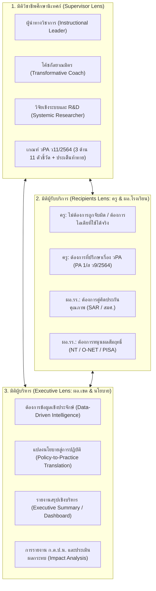

# การวิเคราะห์เชิงยุทธศาสตร์ 3 มิติ และโครงสร้างเอกสาร AI Prompt ศึกษานิเทศก์ (320+ Prompts)

เอกสารฉบับนี้เป็นการสังเคราะห์ข้อมูลเชิงลึกจากคู่มือการปฏิบัติงานศึกษานิเทศก์ทุกสังกัด (สพฐ., สอศ., อปท., สช., กทม., สกร., ตชด.), เกณฑ์ วPA ก.ค.ศ. (ว11/2564, ว22/2564), กฎกระทรวง ก.ต.ป.น. 2548, และมาตรฐานวิชาชีพคุรุสภา เพื่อตอบสนองภารกิจของศึกษานิเทศก์อย่างแท้จริง ผ่านการวิเคราะห์ 3 มิติ และออกแบบโครงสร้างเอกสารคลัง Prompt ฉบับสมบูรณ์กว่า 320+ Prompts

---

## ส่วนที่ 1: การวิเคราะห์เชิงลึก 3 มิติ (3-Dimensional Strategic Analysis)



---

### มิติที่ 1: แง่มุมวิชาชีพของศึกษานิเทศก์ (Supervisor's Professional Lens)
1. **การเปลี่ยนผ่านบทบาท (Role Paradigm Shift)**:
   * จากเดิมที่เป็น "ผู้ตรวจตรา (Inspector)" หรือ "ผู้นำข้อสั่งการ"
   * สู่การเป็น **"ผู้นำทางวิชาการ (Instructional Leader)"** และ **"โค้ชผู้สร้างการเปลี่ยนแปลง (Transformative Coach)"** ที่เน้นการเสริมพลังและชี้แนะแนวทาง
2. **พันธกิจ 3 ด้านตามมาตรฐานตำแหน่ง ก.ค.ศ. (ว11/2564)**:
   * **ด้านที่ 1: การปฏิบัติการนิเทศการศึกษา (5 ตัวชี้วัด)**: ศึกษาสภาพบริบท $\rightarrow$ วางแผนยุทธศาสตร์ $\rightarrow$ สร้างเครื่องมือ $\rightarrow$ ปฏิบัติการนิเทศ $\rightarrow$ ประเมินและรายงานผล
   * **ด้านที่ 2: การส่งเสริมและสนับสนุนการจัดการศึกษา (4 ตัวชี้วัด)**: ผลิตสื่อ/นวัตกรรม $\rightarrow$ ส่งเสริมประกันคุณภาพ (IQA) $\rightarrow$ ประสานเครือข่ายวิชาการและชุมชน
   * **ด้านที่ 3: การพัฒนาตนเองและวิชาชีพ (2 ตัวชี้วัด)**: แผนพัฒนาตนเอง (IDP) $\rightarrow$ ผู้นำในชุมชนแห่งการเรียนรู้ทางวิชาชีพ (PLC)
3. **ระดับความคาดหวังตามวิทยฐานะ**:
   * *ชำนาญการ*: แก้ไขปัญหา (Solving Problems)
   * *ชำนาญการพิเศษ*: ริเริ่ม พัฒนา (Initiating & Developing)
   * *เชี่ยวชาญ*: คิดค้น ปรับเปลี่ยน (Inventing & Transforming)
   * *เชี่ยวชาญพิเศษ*: สร้างการเปลี่ยนแปลงในระดับชาติ (Creating National Impact)
4. **ความเจ็บปวด (Pain Points) ของ ศน.**:
   * ภาระงานเอกสาร โครงการตามนโยบายด่วนที่เข้ามาซ้ำซ้อน
   * จำนวนโรงเรียนและครูในความรับผิดชอบมีมากเกินกำลัง (อัตราส่วน ศน. 1 คน ต่อ 15–25 โรงเรียน)
   * ความหลากหลายของบริบทโรงเรียน (โรงเรียนขนาดเล็ก ครูไม่ครบชั้น, ขยายโอกาส, มัธยมศึกษาประจำอำเภอ)
   * **บทบาท AI**: AI จะช่วยร่างแผนนิเทศ สังเคราะห์ข้อมูลผลสอบ ยกร่างโครงการ และสร้างรูบริกส์ ทำให้ ศน. มีเวลาลงพื้นที่โค้ชชิ่งครูจริง

---

### มิติที่ 2: แง่มุมของผู้รับบริการ (Service Recipients' Lens: ครู, ผู้บริหารสถานศึกษา, นักเรียน)
1. **มุมมองของครูผู้สอน (Teachers)**:
   * **ความกลัว**: ครูส่วนใหญ่กลัวการนิเทศ เพราะกังวลเรื่องการ "จับผิด" หรือการถูกสั่งให้ทำเอกสารเพิ่ม
   * **สิ่งที่ครูต้องการจริง**:
     * *แนวคิดที่ทำได้จริง*: ไม่ใช่ทฤษฎีบนหิ้ง แต่เป็นตัวอย่างกิจกรรม สื่อ และเทคนิคคุมชั้นเรียนที่ใช้ได้ในคาบ 50 นาที
     * *คำชมและการให้กำลังใจ*: การสะท้อนคิดเชิงบวก (Strength-based Reflection) ที่ทำให้ครูรู้สึกภาคภูมิใจ
     * *การเป็นพี่เลี้ยงเรื่อง วPA*: ครูต้องการคำแนะนำในการเขียนข้อตกลง PA 1/ส (ว9/2564) และการตั้งประเด็นท้าทายที่สอดคล้องกับบริบทห้องเรียน
2. **มุมมองของผู้บริหารสถานศึกษา (School Principals / Directors)**:
   * ต้องการให้ ศน. เป็น **"กัลยาณมิตรเชิงยุทธศาสตร์"**: ช่วยมองภาพรวมโรงเรียนโดยไม่ซ้ำเติม
   * ต้องการความช่วยเหลือเรื่อง **ระบบประกันคุณภาพภายใน (IQA)**: ชี้แนะการเขียน SAR และการเตรียมความพร้อมรับการประเมินภายนอก (สมศ.)
   * ต้องการตัวช่วยยกระดับผลสัมฤทธิ์ (NT / O-NET / PISA) ที่เป็นรูปธรรมเพื่อตอบโจทย์ชุมชนและเขตพื้นที่
3. **มุมมองของนักเรียนและชุมชน**:
   * การนิเทศต้องส่งผลสะท้อนถึงห้องเรียนจริง นักเรียนได้เรียนรู้อย่างมีความสุข (Well-being & Active Learning) และลดการเรียนแบบท่องจำ

---

### มิติที่ 3: แง่มุมของผู้บริหารระดับเขตและนโยบาย (Executives & Policy Lens)
1. **มุมมองของ ผอ.เขต / รอง ผอ.เขต**:
   * **Data-Driven Decision Making**: ผู้บริหารไม่ได้ต้องการแค่อ่านบันทึกว่า ศน. ไปโรงเรียนไหนมาบ้าง แต่ต้องการเห็น **"Dashboard สารสนเทศเชิงประจักษ์"** เช่น Gap Analysis ของกลุ่มโรงเรียน, จุดวิกฤตที่ต้องส่งงบประมาณช่วยเหลือ
   * **Executive Summary (รายงานสรุป 1 หน้า)**: กระชับ ชัดเจน มีข้อเสนอแนะเชิงนโยบายที่ผู้บริหารสามารถสั่งการได้ทันที
   * **การขับเคลื่อนนโยบายกระทรวง/ต้นสังกัด**: การแปลงนโยบาย (เช่น "เรียนดี มีความสุข", "PISA ฉลาดรู้", "1 อำเภอ 1 โรงเรียนคุณภาพ") ไปสู่การปฏิบัติจริงในโรงเรียน
2. **มุมมองของคณะกรรมการ ก.ต.ป.น.**:
   * ต้องการรายงานสรุปผลการติดตาม ตรวจสอบ ประเมินผล และนิเทศการศึกษาประจำปี ที่มีตัวเลขและสถิติเปรียบเทียบเชิงพัฒนาการ
   * ต้องการเห็นความคุ้มค่าของการใช้งบประมาณพัฒนาคุณภาพการศึกษา
3. **มุมมองของผู้นำองค์กรปกครองส่วนท้องถิ่น / เอกชน / อาชีวศึกษา**:
   * *อปท. (นายกเทศมนตรี/นายก อบจ.)*: เน้นการศึกษาตอบโจทย์อัตลักษณ์ท้องถิ่น ศูนย์พัฒนาเด็กเล็ก และโรงเรียนกีฬา/ภาษา
   * *สอศ. (ผู้อำนวยการสถาบัน/วิทยาลัย)*: เน้นสมรรถนะวิชาชีพ ความร่วมมือทวิภาคีกับสถานประกอบการ และการมีงานทำของผู้เรียน
   * *สช. (ผู้รับใบอนุญาต/ผู้จัดการ)*: เน้นคุณภาพมาตรฐานสากล จุดเด่นเฉพาะของโรงเรียน และความพึงพอใจของผู้ปกครอง

---

## ส่วนที่ 2: โครงสร้างเอกสารคลัง AI Prompt ศึกษานิเทศก์ ครบชุด 4 เล่ม (320+ Prompts)

```
🏛️ โครงสร้างคลัง AI Prompt ศึกษานิเทศก์ (ทุกสังกัด) — ครบวงจร 320+ Prompts
```

### 🏛️ เล่มที่ 1: ยุทธศาสตร์ วินิจฉัยข้อมูล และแผนนิเทศการศึกษา (75 Prompts)
*เน้น: การวิเคราะห์ข้อมูลสัมฤทธิผล, SAR สถานศึกษา, แผนยุทธศาสตร์, และการออกแบบโครงการนิเทศ*
* **บทนำ**: ปรัชญางานนิเทศการศึกษายุคปัญญาประดิษฐ์ — จาก Inspector สู่ Transformative Coach
* **บทที่ 1: รู้จัก AI สำหรับศึกษานิเทศก์ & S-C-T-F-C Framework** (10 Prompts)
  * โครงสร้างคำสั่ง Supervisor Persona, Master Context ประจำตัว ศน., Chain-of-Thought สำหรับงานนิเทศ
* **บทที่ 2: วินิจฉัยผลสัมฤทธิ์และข้อมูลสารสนเทศทางการศึกษา** (20 Prompts)
  * วิเคราะห์ผลคะแนน NT ป.3, O-NET ป.6/ม.3/ม.6, PISA แยกตามมาตรฐาน/สาระ, การสร้างคลังข้อสอบและวิเคราะห์ Item Analysis
* **บทที่ 3: สังเคราะห์และยกระดับระบบการประกันคุณภาพ (IQA & SAR)** (15 Prompts)
  * การอ่านและสกัดประเด็น SAR โรงเรียน, การทำ SWOT และ Need Assessment, การเตรียมความพร้อมรับ สมศ. รอบใหม่
* **บทที่ 4: การจัดทำแผนยุทธศาสตร์และปฏิทินนิเทศบูรณาการ** (15 Prompts)
  * แผนนิเทศการศึกษาประจำปี 4 ไตรมาส, การจัดกลุ่มโรงเรียนตามสภาพปัญหา (Zoning & Cluster), แผนนิเทศออนไลน์และลงพื้นที่
* **บทที่ 5: การออกแบบโครงการนิเทศและการบริหารงบประมาณ** (15 Prompts)
  * การเขียนโครงการครบ 10 หัวข้อตามระเบียบการคลัง, การคำนวณงบประมาณ, การกำหนด KPI และการบริหารความเสี่ยงโครงการ

---

### 🤝 เล่มที่ 2: นิเทศคลินิก โค้ชชิ่งกัลยาณมิตร และ PLC เครือข่าย (80 Prompts)
*เน้น: สัมพันธภาพเชิงบวก, การสังเกตชั้นเรียน, การโค้ชสะท้อนคิด, และการขับเคลื่อนครูมืออาชีพ*
* **บทนำ**: จิตวิทยาการนิเทศและศาสตร์แห่งการสร้างพื้นที่ปลอดภัยทางวิชาการ (Psychological Safety)
* **บทที่ 1: การนิเทศแบบคลินิกครบวงจร (Clinical Supervision Cycle)** (20 Prompts)
  * ขั้นก่อนสังเกตการสอน (Pre-Conference), ขั้นการสังเกตในห้องเรียน (Classroom Observation), ขั้นสะท้อนคิดหลังสอน (Post-Conference)
* **บทที่ 2: เทคนิคการโค้ชครูแบบไม่ตัดสิน (Coaching & Mentoring)** (20 Prompts)
  * GROWTH Model สำหรับ ศน., การใช้คำถามทรงพลัง (Powerful Questioning), Strength-based Feedback, การรับมือกับความวิตกกังวลของครู
* **บทที่ 3: การนิเทศยกระดับ Active Learning และหลักสูตรสมรรถนะ** (20 Prompts)
  * การนิเทศกระบวนการ GPAS 5 Steps, 5E Model, PBL, STEM/Coding, การเปลี่ยนบทบาทครูสู่ Facilitator, การวัดสมรรถนะผู้เรียน
* **บทที่ 4: การขับเคลื่อนชุมชนแห่งการเรียนรู้ทางวิชาชีพ (PLC ระดับเครือข่าย/เขต)** (20 Prompts)
  * การจัดตั้งเครือข่าย PLC ข้ามโรงเรียน, บทบาท Facilitator ของ ศน., การถอดบทเรียน (After Action Review), การเผยแพร่นวัตกรรม

---

### 📊 เล่มที่ 3: เครื่องมือนิเทศ วิจัย R&D และการประเมินเชิงระบบ (80 Prompts)
*เน้น: การสร้างเครื่องมือประเมินเชิงพฤติกรรม, การวิจัยของ ศน., และการรายงานผลเชิงยุทธศาสตร์*
* **บทนำ**: ฐานคิดการสร้างเครื่องมือนิเทศที่มีความเที่ยงตรง (Validity) และเชื่อถือได้ (Reliability)
* **บทที่ 1: การสร้างแบบสังเกตชั้นเรียนและรูบริกส์ประเมินเชิงพฤติกรรม** (25 Prompts)
  * Rubrics สังเกตการสอน Active Learning, เกณฑ์ประเมินแผนการจัดการเรียนรู้สมรรถนะ, แบบประเมินบรรยากาศชั้นเรียนเชิงบวก
* **บทที่ 2: เช็กลิสต์ตรวจเยี่ยมความพร้อมสถานศึกษาและการติดตามนโยบาย** (15 Prompts)
  * เช็กลิสต์เปิดภาคเรียน, การติดตามนโยบายความปลอดภัย (Safety Center), การลดภาระครูและการลดการบ้าน, สุขาภิบาลและโภชนาการ
* **บทที่ 3: การวิจัยและพัฒนานวัตกรรมการนิเทศ (Educational R&D & Action Research)** (20 Prompts)
  * การตั้งโจทย์วิจัยแก้ปัญหาเชิงระบบในเขต, การออกแบบโมเดลการนิเทศ (Supervision Model), การทดลองใช้และการหาประสิทธิภาพ E1/E2
* **บทที่ 4: การประเมินโครงการและรายงานผลกระทบเชิงประจักษ์ (Impact Report)** (20 Prompts)
  * การเขียน Executive Summary เสนอ ผอ.เขต, รายงานผลการนิเทศประจำปี, การประเมินความคุ้มค่า (ROI & SROI) ทางการศึกษา

---

### 🎖️ เล่มที่ 4: วPA ศน. ประเด็นท้าทาย และการนิเทศเฉพาะสังกัด (85 Prompts)
*เน้น: ความก้าวหน้าในวิชาชีพ ก.ค.ศ. ว11/2564, Portfolio, และภารกิจเฉพาะของแต่ละสังกัด*
* **บทนำ**: เส้นทางวิชาชีพศึกษานิเทศก์สู่ตำแหน่งชำนาญการพิเศษและเชี่ยวชาญ
* **บทที่ 1: การจัดทำข้อตกลง วPA ศึกษานิเทศก์ ตามเกณฑ์ ว11/2564** (25 Prompts)
  * ด้านที่ 1 การปฏิบัติการนิเทศ (5 ตัวชี้วัด), ด้านที่ 2 การส่งเสริมสนับสนุน (4 ตัวชี้วัด), ด้านที่ 3 การพัฒนาตนเอง (2 ตัวชี้วัด)
* **บทที่ 2: การเขียนประเด็นท้าทาย (Challenge Issue) ระดับเขตพื้นที่** (20 Prompts)
  * การเขียนประเด็นท้าทายระดับริเริ่มพัฒนา (ชำนาญการพิเศษ), ระดับคิดค้นปรับเปลี่ยน (เชี่ยวชาญ), การวัดผลลัพธ์เชิงปริมาณและคุณภาพ
* **บทที่ 3: รายงานประเมินตนเอง (SAR ศน.) แฟ้มสะสมงาน และรายงาน ก.ต.ป.น.** (15 Prompts)
  * การเขียน Narrative Portfolio, การสังเคราะห์หลักฐานเชิงประจักษ์, รายงานสรุปผลงานเสนอต่อคณะกรรมการ ก.ต.ป.น.
* **บทที่ 4: คลัง AI Prompt เฉพาะสังกัด (Multi-Jurisdiction Prompts)** (25 Prompts)
  * *สอศ. (อาชีวศึกษา)*: การนิเทศระบบทวิภาคี, แผนฝึกอาชีพในสถานประกอบการ, สิ่งประดิษฐ์คนรุ่นใหม่
  * *อปท. (ท้องถิ่น)*: การจัดการศึกษาท้องถิ่น, ศูนย์พัฒนาเด็กเล็ก (ศพด.), แผนพัฒนาการศึกษาท้องถิ่น
  * *สช. (เอกชน)*: การนิเทศโรงเรียนเอกชนสองภาษา/นานาชาติ, การประกันคุณภาพตาม พ.ร.บ.โรงเรียนเอกชน
  * *กทม. (กรุงเทพมหานคร)*: โรงเรียนสังกัด กทม. ในบริบทชุมชนเมืองหลวง, นโยบายเรียนดี ปลอดภัย
  * *สกร. (ส่งเสริมการเรียนรู้)*: การศึกษาตลอดชีวิต, เทียบระดับ, ทักษะอาชีพประชาชน
  * *ตชด. (ตำรวจตระเวนชายแดน)*: โครงการตามพระราชดำริ กพด., การสอนภาษาไทยในถิ่นทุรกันดาร
